# Delivery Standard Operating Procedure (SOP)

**Canonical workflow for InterCraft multi-client delivery governance.**

| Field | Value |
|---|---|
| Document | `docs/engineering/delivery-sop.md` |
| Governance version | `stage-a-owner-pr-bypass-v1` |
| Status | SOP v1 — normative; Dispatch, PR Gate, and core CI active |
| Issue | [REQ-064 — 跨应用交付治理](../../specs/064-delivery-governance/) |
| ADR | [ADR-001: Multi-Client Delivery Governance](../decisions/ADR-001-multi-client-delivery-governance.md) |

> **This is the single canonical workflow.** Client adapter files (`AGENTS.md`,
> `CLAUDE.md`, `.cursor/rules/`) reference but do not duplicate this document.
> If any client rule contradicts this SOP, the SOP prevails.

---

## Table of Contents

1. [Overview](#1-overview)
2. [Roles](#2-roles)
3. [Canonical Flow](#3-canonical-flow)
4. [Step Details](#4-step-details)
5. [Dispatch Envelope & AC Normalization](#5-dispatch-envelope--ac-normalization)
6. [Preflight Gate (Phase 3, Active)](#6-preflight-gate-phase-3-active)
7. [PR Gate (Active)](#7-pr-gate-active)
8. [Failure Codes & Stop Rules](#8-failure-codes--stop-rules)
9. [Rollback Procedure](#9-rollback-procedure)
10. [Break-Glass & Drift Evidence](#10-break-glass--drift-evidence)
11. [Authoritative Ref Verification & Transport Failure](#11-authoritative-ref-verification--transport-failure)
12. [Authorization & Approval](#12-authorization--approval)

---

## 1. Overview

### 1.1 Purpose

Transform InterCraft development from direct-to-`master` changes into a
standardized delivery pipeline:

```
Spec → Issue → Dispatch → fresh external clone/worktree + codex/ branch
→ fail-closed preflight → bounded change → test/evidence → intentional commit
→ Draft PR with Refs → CI → review → squash merge → authoritative master
verification → Issue/requirement closure
```

### 1.2 Key Principles

1. **Every change goes through the full pipeline.** No path from local editor to
   `master` bypasses PR, CI, and review.
2. **Fail-closed.** Every gate check defaults to denial unless explicitly passed.
3. **One active dispatch per Issue.** GitHub cannot prevent two clients starting
   simultaneously; the system guarantees at most one passing PR per Issue.
4. **Authoritative remote is truth.** Never rely on stale local `origin/master`;
   always verify via `gh api` when local transport is unreliable.
5. **Direct push to `master` is forbidden.** Enforced by Stage-A Ruleset
   (18825748); no bypass permitted.
6. **Default approval: one human non-author.** Sandape Owner may use PR-only
   bypass with explicit reason and evidence. Direct push bypass remains
   forbidden under all circumstances.
7. **NekoDreamSensei is optional, never mandatory** for review or blocking.

---

## 2. Roles

| Role | Identity | Responsibilities |
|---|---|---|
| **Codex** | Supervising acceptance authority | Issues dispatches, performs acceptance verification, and applies Stage-B only under explicit Sandape Owner R3 confirmation/delegation |
| **Driver** | `claude-code`, `codex`, `cursor`, `cursor-automation`, or `human` | Executes the work assigned by a dispatch: implements changes, writes tests, produces evidence, opens PR |
| **Reviewer** | Human (not the PR author) | Performs code review, verifies AC compliance, checks evidence, approves or requests changes |
| **Sandape Owner** | Repository / product owner | Owns PR-only bypass authority (see [§12.2](#122-owner-pr-only-bypass)); can delegate bypass to Codex with explicit case-by-case confirmation |
| **NekoDreamSensei** | Optional reviewer | May be `@mentioned` for domain-specific review; never a mandatory blocker or CODEOWNERS requirement |

---

## 3. Canonical Flow

```mermaid
graph LR
    A[Spec] --> B[Issue]
    B --> C[Dispatch]
    C --> D[External Clone / Worktree + codex/ Branch]
    D --> E[Preflight]
    E --> F[Bounded Change]
    F --> G[Test / Evidence]
    G --> H[Intentional Commit]
    H --> I[Draft PR + Refs #N]
    I --> J[CI]
    J --> K[Review]
    K --> L[Squash Merge]
    L --> M[Master Verification]
    M --> N[Issue / Requirement Closure]
```



### State Transitions

| Step | From | To | Gate / Condition |
|---|---|---|---|
| Spec → Issue | Spec accepted | Issue created (open) | Spec exists and is accepted by Codex |
| Issue → Dispatch | Issue open | Dispatch issued (active) | Codex assigns driver, creates dispatch envelope |
| Dispatch → Branch | Dispatch active | Branch created | Fresh external clone or git worktree; branch name prefixed `codex/` |
| Branch → Preflight | Branch ready | Preflight passes | `preflight.ps1` exits 0 |
| Preflight → Change | Preflight passed | Changes authored | Allowed paths respected; no dirty root |
| Change → Commit | Changes ready | Committed | Intentional commit message with `Refs #N` |
| Commit → Draft PR | Pushed branch | Draft PR opened | PR body contains dispatch_id, base_sha, AC hash, allowed paths |
| Draft PR → CI | PR opened | CI jobs complete | `frontend-core`, `backend-core`, and `playwright-smoke` pass; full suites remain manual/scheduled |
| CI → Review | CI green (or known-fail documented) | Review requested | At least one human non-author reviewer assigned |
| Review → Squash Merge | Approved | Merged to master | Non-author approval; or Owner PR-only bypass with evidence |
| Squash Merge → Master Verify | Merged | `master` HEAD verified | `gh api` confirms merge SHA is ancestor of `master` |
| Master Verify → Closure | Verified | Issue closed / req done | AC met; evidence exists; `requirements-status.md` updated |

---

## 4. Step Details

### 4.1 Spec

- A canonical requirement spec exists under `specs/<id>-<feature>/`.
- Accepted by Codex before any implementation Issue is created.
- Spec must include: `spec.md`, `plan.md`, `tasks.md`, `requirements-status.md`,
  and necessary `contracts/`.

### 4.2 Issue

- Created using the appropriate Issue Form when available; otherwise use the
  same canonical headings directly in the Issue body.
- Minimum fields: `dispatch_id`, `base_sha`, `AC hash`, `allowed_paths`.
- If no Issue Form exists yet, include these fields in the Issue body as
  structured YAML frontmatter or a table.
- The Issue contains a **Canonical Acceptance Statement** — a single heading
  `## Canonical Acceptance Statement` whose content is the authoritative AC text
  (see [§5.2](#52-canonical-acceptance-criteria-v1-normalization)).
- Issue number (`#N`) becomes the canonical reference for all related work.

### 4.3 Dispatch

- Codex creates and validates a dispatch envelope with
  `scripts/governance/dispatch.ps1`. The envelope is stored in
  `.github/dispatches/` for the bounded delivery and supplied to the PR Gate.
- A dispatch MUST include all fields defined in [§5.1](#51-dispatch-envelope-fields).
- At most one active dispatch per Issue. A new dispatch supersedes the old one.

### 4.4 Fresh External Clone / Worktree

- Work from a **fresh external clone** or a **dedicated git worktree** to avoid
  conflicts with dirty primary worktrees.
- Branch name MUST use the repository `codex/` governance prefix regardless of
  which client is the dispatch driver, e.g. `codex/064-phase5a-sop-adr`.
- Branch MUST fork from the authoritative remote `master` HEAD at dispatch time.

```bash
# External clone
git clone https://github.com/Sandape/interCraft.git interCraft-work
cd interCraft-work
git switch -c codex/064-phase5a-sop-adr <dispatch-base-sha>

# Or worktree (from primary clone)
git worktree add -b codex/064-phase5a-sop-adr ../interCraft-work <dispatch-base-sha>
```

### 4.5 Preflight

Run the preflight gate from an existing PowerShell session. All parameters are
mandatory; a parameterless invocation is invalid:

```powershell
$preflight = @{
  ExpectedRepoRoot = (Resolve-Path .).Path
  ExpectedBranch = 'codex/064-phase5a-sop-adr'
  ExpectedBaseSha = '<40-character-dispatch-base-sha>'
  BaseRef = 'origin/master'
  AllowedPath = @('<allowed/path-1>', '<allowed/path-2>')
  TargetPath = @('<target/path-1>', '<target/path-2>')
  OutputJson = $true
}
& scripts/governance/preflight.ps1 @preflight
```

Before editing and after committing, the worktree MUST be clean. While the
bounded target files are intentionally modified, add
`AllowDirtyWithinAllowedPaths = $true`; preflight still rejects every dirty
path outside the allowlist.

Preflight verifies:
1. Repository root is correct
2. Branch is not `master`
3. The caller-verified local `BaseRef` matches the expected dispatch base
4. No dirty state in the worktree
5. All changed paths are within allowed paths

**If preflight fails, stop and resolve the cause before committing.** Preflight
has no authorized bypass mode; do not invent force/skip flags or weaken its
checks in a handoff note.

### 4.6 Bounded Change

- Change only files within the dispatch's `allowed_paths`.
- Each PR slice has a single focus. Do not mix refactoring, CI fixes, or
  unrelated docs changes with feature work.
- Follow existing code style, comment density, and naming conventions.

### 4.7 Test / Evidence

- Every change MUST include or reference verification evidence:
  - **Tests**: Unit, integration, or E2E tests that pass.
  - **Evidence**: Screenshots, logs, API responses, or CI run links in
    `docs/evidence/<req-id>/`.
- Evidence is required before requesting review, not as an afterthought.

### 4.8 Intentional Commit

```bash
git add <files>
git commit -m "feat(scope): descriptive message

Refs #<issue-number>
Co-Authored-By: Claude <noreply@anthropic.com>"
```

- Commit messages MUST include `Refs #N` linking to the Issue.
- Each commit should be atomic and independently understandable.
- Do not use `Closes #N` unless the full requirement is verified and accepted.

### 4.9 Draft PR

```bash
gh pr create \
  --base master \
  --draft \
  --title "<descriptive title>" \
  --body "Refs #<issue-number>

## Dispatch
- **Dispatch ID**: req-064-<purpose>-<yyyymmdd>-<nn>
- **Base SHA**: <full-sha>
- **AC Hash**: <sha256-hex>
- **Allowed paths**: <path1>, <path2>

## Files Changed
- <path/to/file> — <reason>

## Checks Performed
- [ ] Preflight passed
- [ ] git diff --check passed
- [ ] Tests added / existing tests pass
- [ ] Evidence collected (if applicable)

## Risk & Rollback
- **Risk**: Low / Medium / High
- **Rollback**: create a governed rollback branch/PR and run \`git revert <squash-merge-sha>\` (never \`-m\` for a squash commit)

## Unrun Checks
- CI (awaiting PR open)
- Review (Draft)"
```

### 4.10 CI

- CI runs automatically when the PR is opened or synchronized.
- **Current required MVP checks**:
  - `frontend-core`: AI-contract parity, typecheck, production build, and the
    named reliable unit smoke set.
  - `backend-core`: locked dependency sync and the named reliable unit smoke
    set.
  - `playwright-smoke`: PostgreSQL/Redis service orchestration, migrations,
    frontend/backend startup and health waits, the core browser path, and
    retained failure artifacts.
- Full frontend/backend suites run on `workflow_dispatch` and schedule without
  `continue-on-error`; full Playwright E2E runs on `workflow_dispatch`. Their
  failures stay visible without blocking every PR while legacy failures are
  repaired.
- Stage-A currently requires PR delivery and one review, with Sandape's
  documented PR-only owner bypass. Required status-check names may be promoted
  in a later ruleset stage after their stability window; until then, the
  merge checklist and PR evidence require all three MVP checks to pass.

### 4.11 Review

- **Default**: At least one human non-author approval required.
- **Reviewer** checks:
  - AC compliance: do the changes match the Canonical Acceptance Statement?
  - Code quality: idiomatic, documented, tested.
  - Evidence: present and accurate.
  - Path discipline: no files outside `allowed_paths`.
- Request changes by commenting; author addresses and re-requests.
- Once approved, the author or reviewer may squash-merge (if authorized).

### 4.12 Squash Merge

```bash
gh pr merge <pr-number> --squash --delete-branch
```

Or via GitHub UI: **Squash and merge** (default merge method).

**Before merging**, verify:
- [ ] Required approvals obtained (or Owner PR-only bypass documented)
- [ ] Preflight passed on final commit
- [ ] All checks passed (or known-fail documented and accepted)
- [ ] Rollback command documented in PR body

### 4.13 Master Verification

After merge, verify the authoritative remote:

```bash
gh api repos/Sandape/interCraft/git/ref/heads/master --jq '.object.sha'
```

Compare against local expectation. If the SHA matches the merge commit, the
pipeline succeeded.

### 4.14 Issue / Requirement Closure

- Issue is closed only when:
  1. Implementation merged and verified on `master`.
  2. Verification evidence exists and is linked from the Issue.
  3. `requirements-status.md` updated to reflect completion.
- Keep `Refs #N` through merge, then close the Issue manually only after
  authoritative master and evidence verification. Do not let `Closes #N`
  auto-close it before those checks finish.

---

## 5. Dispatch Envelope & AC Normalization

### 5.1 Dispatch Envelope Fields

| Field | Type | Required | Description |
|---|---|---|---|
| `dispatch_id` | string | yes | Unique ID: `<req-prefix>-<purpose>-<yyyymmdd>-<nn>` |
| `driver` | string | yes | `claude-code`, `codex`, `cursor`, `cursor-automation`, `human` |
| `issue_number` | integer | yes | GitHub Issue number |
| `base_sha` | string | yes | Full SHA of authoritative remote `master` at dispatch time |
| `spec_task_id` | string | yes | e.g. `REQ-064`, `T101` |
| `ac_hash` | string | yes | SHA-256 hex of canonical AC text (see §5.2) |
| `canonical_ac_text_version` | string | yes | Normalization version, e.g. `v1` |
| `allowed_paths` | string[] | yes | Glob patterns for permitted files |
| `governance_version` | string | yes | e.g. `stage-a-owner-pr-bypass-v1` |
| `created_at` | string (ISO 8601) | yes | Timestamp |
| `state` | string | yes | `active` \| `superseded` \| `expired` |

### 5.2 Canonical Acceptance Criteria v1 Normalization

The `ac_hash` is the SHA-256 digest of the canonical acceptance statement, NOT
the entire Issue body, NOT the mutable checkbox list.

**Selection rules (v1):**

1. In the Issue body, find a level-2 heading (`##`) whose trimmed text
   case-insensitively equals `Canonical Acceptance Statement`.
2. Its content is everything from the first non-blank line after the heading
   to the next heading of the same or higher level (`##` or `#` or end of body).
3. If missing: fail closed (`GATE_AC_MALFORMED`).
4. If duplicated (two headings with same text): fail closed.
5. If empty (heading with no content): fail closed.

**Normalization (v1):**

1. Encode as UTF-8.
2. Apply Unicode NFC normalization.
3. Convert CRLF and CR to LF.
4. Strip leading and trailing whitespace per line.
5. Remove trailing blank lines.
6. Compute SHA-256 digest as lowercase hex string.

**Result**: Changing acceptance checkboxes, adding comments, or editing non-AC
sections does NOT change the hash. Only editing the canonical AC heading content
changes it.

### 5.3 State Machine

```
                 ┌──────────────┐
                 │   active     │
                 └──────┬───────┘
                        │
          ┌─────────────┼─────────────┐
          │             │             │
          ▼             ▼             ▼
   ┌──────────┐  ┌────────────┐  ┌──────────┐
   │superseded│  │  expired   │  │(remains  │
   │(by new   │  │(base SHA   │  │ active)  │
   │ dispatch)│  │ diverged   │  │          │
   └──────────┘  └────────────┘  └──────────┘
```

**Transitions:**

| Transition | Trigger | Effect |
|---|---|---|
| `active → superseded` | New dispatch for same Issue | Old dispatch deactivated |
| `active → expired` | Base SHA diverged from authoritative master; or AC hash no longer matches Issue | Dispatch invalidated |
| `active → (stays active)` | No conflict | At most one PR per dispatch |
| `superseded/expired → any` | FORBIDDEN | Reactivation not permitted |

### 5.4 Dispatch Validation Rules

1. `dispatch_id` MUST be globally unique.
2. `ac_hash` MUST equal SHA-256(normalized canonical AC text) per §5.2.
3. `allowed_paths` MUST be a subset of the Issue's allowed paths.
4. `base_sha` MUST equal authoritative remote `master` HEAD via `gh api`, not
   stale local `origin/master`.
5. At Gate validation time: `base_sha` must still equal `master` HEAD, AND PR
   HEAD must descend from `base_sha`.

---

## 6. Preflight Gate (Phase 3, Active)

The preflight gate runs locally before every commit.

**Location**: `scripts/governance/preflight.ps1`

### Checks

| Check | Actual failure code(s) |
|---|---|
| Repository root equals the dispatched root | `REPO_ROOT_MISMATCH` |
| Named branch is present, not protected, and equals the dispatched branch | `DETACHED_HEAD`, `PROTECTED_BRANCH`, `BRANCH_MISMATCH` |
| Caller-verified local `BaseRef` exists, equals the dispatch base, and is an ancestor of HEAD | `BASE_REF_MISSING`, `BASE_SHA_MISMATCH` |
| Allowlist and target paths use the supported safe syntax | `INVALID_ALLOWED_PATH`, `INVALID_TARGET_PATH` |
| Every target path is inside the dispatch allowlist | `TARGET_NOT_ALLOWED` |
| Dirty status is parseable and either absent or wholly allowlisted in explicit scoped mode | `DIRTY_STATUS_UNPARSEABLE`, `DIRTY_WORKTREE`, `DIRTY_PATH_ESCAPE` |

### Usage

Use the mandatory PowerShell parameter hashtable in [§4.5](#45-preflight).
Run it once in clean mode before editing, once with
`AllowDirtyWithinAllowedPaths = $true` while reviewing intended edits, and once
again in clean mode after the commit.

Exit code 0 = pass. Any non-zero exit = stop and fix.

---

## 7. PR Gate (Active)

The PR Gate is an implemented, fail-closed local acceptance command that
validates a GitHub PR against its dispatch before review or owner-bypass merge.
It uses authenticated GitHub API reads and does not mutate repository state.

**Location**: `scripts/governance/gate.ps1`

### Enforced Checks

**General (always run):**
| Code | Check |
|---|---|
| `GATE_INVALID_TARGET` | PR base ref must be `master` |
| `GATE_MISSING_ISSUE_REF` | PR body must contain `Refs #N` |
| `GATE_MISSING_EVIDENCE` | PR body must contain a substantive `## Evidence` section |

**Dispatch Validation:**
| Code | Check |
|---|---|
| `GATE_ISSUE_NOT_OPEN` | Referenced Issue must exist and be open |
| `GATE_DISPATCH_NOT_FOUND` | Dispatch envelope must exist |
| `GATE_DISPATCH_INACTIVE` | Dispatch state must be `active` |
| `GATE_DISPATCH_REF_MALFORMED` | PR dispatch metadata must be canonical and unambiguous |
| `GATE_DISPATCH_CORRUPT` / `GATE_DISPATCH_VALIDATION_FAILED` | Dispatch store and child validation must succeed |
| `GATE_AC_HASH_MISMATCH` | AC hash must match canonical statement |
| `GATE_AC_MALFORMED` | Canonical AC statement must be well-formed |

**Path Validation:**
| Code | Check |
|---|---|
| `GATE_PATH_ESCAPE` | All changed paths within `allowed_paths` |

**Freshness & Uniqueness:**
| Code | Check |
|---|---|
| `GATE_BASE_NOT_AUTHORITATIVE` | `base_sha` must equal remote `master` HEAD |
| `GATE_BASE_STALE` | PR HEAD must descend from `base_sha` |
| `GATE_DUPLICATE_PR` | No other open PR for same Issue |
| `GATE_GOV_VERSION_MISMATCH` | Governance version must match active version |

**Transport & Response Integrity:**
| Code | Check |
|---|---|
| `GATE_TRANSPORT_FAILURE` | Authenticated GitHub API reads must succeed |
| `GATE_JSON_PARSE_FAILED` | GitHub responses must contain the required valid JSON shape |
| `GATE_PAGINATION_AMBIGUOUS` | Paginated results must complete within the safety cap |

---

## 8. Failure Codes & Stop Rules

### Preflight Failure Codes

| Code | Meaning | Action |
|---|---|---|
| `REPO_ROOT_MISMATCH` | Actual root differs from dispatched root | Stop and enter the exact external workspace |
| `DETACHED_HEAD` / `PROTECTED_BRANCH` / `BRANCH_MISMATCH` | Branch identity is unsafe or unexpected | Create/switch to the exact dispatched `codex/` branch |
| `BASE_REF_MISSING` / `BASE_SHA_MISMATCH` | Local BaseRef is missing, stale, or not an ancestor of HEAD | Stop; verify authoritative master and obtain a fresh dispatch if it advanced |
| `INVALID_ALLOWED_PATH` / `INVALID_TARGET_PATH` | A path is absolute, traversing, control-bearing, or uses an unsupported glob | Correct the dispatch/target; never weaken validation |
| `TARGET_NOT_ALLOWED` | A target is outside the dispatch allowlist | Stop and obtain a reviewed fresh dispatch if broader scope is truly required |
| `DIRTY_STATUS_UNPARSEABLE` | Git status contains a path that cannot be handled deterministically | Stop for manual ownership review |
| `DIRTY_WORKTREE` | Worktree is dirty in clean-required mode | Classify every dirty path; use scoped mode only for fully allowlisted intended edits |
| `DIRTY_PATH_ESCAPE` | Scoped dirty path is outside the allowlist | Stop and preserve unowned work; do not commit, stash, or delete it |

### Gate Failure Codes

| Code | Meaning | Action |
|---|---|---|
| `GATE_INVALID_TARGET` | PR not targeting `master` | Change PR base |
| `GATE_MISSING_ISSUE_REF` | Missing `Refs #N` | Update PR body |
| `GATE_ISSUE_NOT_OPEN` | Issue closed or not found | Reopen or new Issue |
| `GATE_DISPATCH_NOT_FOUND` | No dispatch for this Issue | Contact Codex |
| `GATE_DISPATCH_INACTIVE` | Dispatch superseded or expired | Request new dispatch |
| `GATE_DISPATCH_REF_MALFORMED` | PR dispatch metadata is missing, duplicated, or malformed | Correct the PR body |
| `GATE_DISPATCH_CORRUPT` / `GATE_DISPATCH_VALIDATION_FAILED` | Dispatch store or child validation failed | Stop and repair the dispatch boundary |
| `GATE_AC_HASH_MISMATCH` | Canonical AC hash changed | Expire the old dispatch and issue a fresh one after revalidation |
| `GATE_AC_MALFORMED` | AC statement malformed | Fix Issue AC section |
| `GATE_PATH_ESCAPE` | Changes outside allowed paths | Stop and preserve unowned work; narrow the branch or issue a reviewed fresh dispatch |
| `GATE_BASE_NOT_AUTHORITATIVE` | base_sha != remote master | Rebase and new dispatch |
| `GATE_BASE_STALE` | PR not derived from base_sha | Rebase PR |
| `GATE_DUPLICATE_PR` | Another PR exists for same Issue | Close duplicate or supersede |
| `GATE_GOV_VERSION_MISMATCH` | Governance version mismatch | Update dispatch |
| `GATE_MISSING_EVIDENCE` | PR body lacks substantive evidence | Add exact test, review, and artifact evidence |
| `GATE_TRANSPORT_FAILURE` | GitHub transport or authentication failed | Stop; restore authenticated access and retry |
| `GATE_JSON_PARSE_FAILED` / `GATE_PAGINATION_AMBIGUOUS` | Remote response is malformed or enumeration is incomplete | Stop and investigate; never assume a partial pass |

### Stop Rules

- **Any preflight failure**: STOP. Fix before proceeding.
- **Any gate failure**: STOP. PR cannot proceed until resolved.
- **Direct push to master detected**: STOP. Ruleset blocks it. If somehow
  bypassed, file a governance incident immediately.
- **Dirty primary worktree found during external clone work**: STOP. Do not
  commit or push from a dirty context. Classify and route dirty entries per
  Phase 10 reconciliation plan.
- **Handoff detected**: STOP the old dispatch. Old PR cannot proceed. New
  dispatch required.

---

## 9. Rollback Procedure

### Standard Rollback

Every repository merge is a squash merge and produces a single-parent commit.
Rollback is another governed delivery, never a direct push:

```bash
# After creating a rollback Issue and fresh dispatch from authoritative master
git switch -c codex/<req>-rollback-<purpose> <authoritative-master-sha>
git revert <squash-merge-sha>   # no -m: the squash commit is not a merge commit
# Run tests/preflight, commit if needed, push this branch, then open a Draft PR
```

### Rollback Verification

After revert, verify:
1. Repository returns to its state before the reverted PR.
2. No residual changes remain from the reverted PR.
3. A new Issue and dispatch are created for any re-attempt.

### Rollback Principles

1. Every PR slice MUST define a reversible boundary. Dependencies are allowed
   but must be explicit; reverting an earlier slice may require reverting its
   dependent slices in reverse order or first adding a compatibility change.
2. `git revert <squash-merge-sha>` without `-m` creates the inverse commit;
   deliver it through a new Draft PR, review or documented Owner PR-only
   bypass, and squash merge.
3. `git reset --hard` MUST NOT be used on a shared branch.
4. After rollback, the original Issue is re-opened (if closed) with a note
   about the revert.

---

## 10. Break-Glass & Drift Evidence

### Break-Glass Procedure

In exceptional circumstances requiring urgent deviation from the standard flow:

1. **Document**: Create a governance Issue documenting what, why, and the
   expected duration of deviation.
2. **Authorize**: Obtain explicit Sandape Owner confirmation. Codex may execute
   only under case-by-case delegation; it does not replace Owner authorization.
3. **Execute**: Perform the minimum necessary deviation.
4. **Evidence**: Capture screenshots, CLI logs, API responses, and timestamps.
5. **Restore**: Return to standard flow as soon as the emergency passes.
6. **Review**: Conduct a post-incident review within 5 business days.

### Drift Detection

- The governance system tracks expected state of Ruleset, dispatch files, and
  workflow configurations.
- Drift detection scripts (planned for Phase 9) compare expected vs actual:
  - Ruleset configuration
  - Repository settings
  - Workflow file contents
  - Dispatch file validity
- If drift is detected, a governance Issue is automatically created.

### Break-Glass Evidence Requirements

| Artifact | Required | Format |
|---|---|---|
| Incident description | Yes | Issue comment or PR body |
| Authorization evidence | Yes | Screenshot or link to Owner confirmation |
| CLI/API log | Yes | Text or JSON |
| Screenshot | Recommended | PNG or JPEG |
| Timestamp | Yes | ISO 8601 |
| Rollback or remediation plan | Yes | Documented in Issue |

---

## 11. Authoritative Ref Verification & Transport Failure

### Problem

Local `origin/master` can become stale. Using it as the source of truth for
`base_sha` or freshness checks can cause incorrect preflight passes or failures.

### Solution

Always verify authoritative remote `master` HEAD via GitHub API:

```bash
# STALE — do not rely on this:
git rev-parse origin/master

# AUTHORITATIVE — use this:
gh api repos/Sandape/interCraft/git/ref/heads/master --jq '.object.sha'
```

### When Local Transport Is Unavailable

If `gh api` fails (network, 403, TLS), freshness is unproven and the workflow
MUST fail closed:

1. Preserve the bounded work without committing or opening/updating a PR.
2. Do not substitute `origin/master`, disable TLS verification, or weaken
   certificate checks.
3. Retry authenticated GitHub access; if failure persists, escalate to Codex
   or the Sandape Owner with the error and timestamp.
4. When transport is restored, re-read authoritative `master`. If it advanced,
   expire the dispatch, issue a fresh one, and update the branch from that base.

### Preflight Integration

The current preflight validates the caller-supplied local `BaseRef`; it does not
query GitHub and does not implement a network fallback. The caller MUST first
prove that `origin/master` and the dispatch base both equal authoritative
GitHub `master`, then invoke preflight with the mandatory parameter hashtable:

```
1. Read authoritative master with gh api; on failure, STOP.
2. Fetch origin/master and require it to equal the authoritative SHA.
3. Require dispatch base_sha to equal that SHA.
4. Invoke preflight with BaseRef=origin/master and the exact dispatch fields.
```

---

## 12. Authorization & Approval

### 12.1 Default Approval

- Every PR merging to `master` requires at least **one human non-author
  approval**.
- The reviewer must not be the PR author.
- Approval must be explicit (GitHub Review Approval or PR comment stating
  approval).

### 12.2 Owner PR-Only Bypass

The Sandape Owner (or explicitly delegated Codex, case-by-case) MAY bypass the
human non-author approval requirement **only** under these conditions:

1. **PR-only**: The change must still go through a PR (Draft or Ready). Direct
   push bypass remains forbidden in all cases.
2. **Explicit reason**: The PR body or a comment must state why the bypass is
   necessary (e.g., urgent security fix, trivial governance metadata change).
3. **Evidence**: Screenshots, logs, or other verifiable evidence of the
   exemption rationale must be captured in the PR or linked Issue.
4. **Documentation**: The bypass must be recorded in the PR before merge so
   audit trail is preserved.

### 12.3 Prohibited Actions

| Action | Status | Notes |
|---|---|---|
| Direct push to `master` | **Forbidden** | Enforced by Stage-A Ruleset; no bypass |
| Automation self-approval | **Forbidden** | Automation scripts never approve or merge |
| Automation self-merge | **Forbidden** | Only humans (or delegated Owner) may merge |
| Bypassing preflight | **Forbidden** | Unless documented and authorized per §10 |

### 12.4 Review Assignment

- NekoDreamSensei is **not** a mandatory reviewer.
- If NekoDreamSensei's domain expertise is needed, `@mention` in the PR.
- There is no mandatory CODEOWNERS reviewer for governance paths; request
  optional domain reviewers case by case.

---

## Appendix A: Quick Reference

| Situation | Command / Action |
|---|---|
| Create external worktree | `git worktree add -b <codex/branch> ../<name> <dispatch-base-sha>` |
| Run preflight | Use the mandatory PowerShell parameter hashtable in §4.5/§6 |
| Open Draft PR | `gh pr create --base master --draft --title "..." --body "Refs #N"` |
| Get authoritative master SHA | `gh api repos/Sandape/interCraft/git/ref/heads/master --jq '.object.sha'` |
| Squash merge | `gh pr merge <N> --squash --delete-branch` |
| Rollback | New Issue/dispatch/branch + `git revert <squash-merge-sha>` + Draft PR |
| File governance incident | Create Issue with label `governance` |

## Appendix B: Related Documents

| Document | Path | Relationship |
|---|---|---|
| Team Onboarding | [./team-onboarding.md](./team-onboarding.md) | Fresh-clone setup guide referencing this SOP |
| ADR-001 | [../decisions/ADR-001-multi-client-delivery-governance.md](../decisions/ADR-001-multi-client-delivery-governance.md) | Architecture decisions behind this SOP |
| AGENTS.md | [../../AGENTS.md](../../AGENTS.md) | Current short agent routing layer |
| Specs Index | [../../specs/README.md](../../specs/README.md) | Canonical requirements source |
| REQ-064 Spec | [../../specs/064-delivery-governance/](../../specs/064-delivery-governance/) | Full specification and contracts |
| Preflight | [../../scripts/governance/preflight.ps1](../../scripts/governance/preflight.ps1) | Pre-commit gate (Phase 3, active) |
