# Delivery Standard Operating Procedure (SOP)

**Canonical workflow for InterCraft multi-client delivery governance.**

| Field | Value |
|---|---|
| Document | `docs/engineering/delivery-sop.md` |
| Governance version | `stage-a-owner-pr-bypass-v1` |
| Status | Phase 5a — normative; Gate automation (Phase 6) pending |
| Issue | [REQ-064 — 跨应用交付治理](../../specs/064-delivery-governance/) |
| ADR | [ADR-001: Multi-Client Delivery Governance](../decisions/ADR-001-multi-client-delivery-governance.md) |

> **This is the single canonical workflow.** Client adapter files (`AGENTS.md`,
> `CLAUDE.md`, `.cursor/rules/`) reference but do not duplicate this document.
> If any client rule contradicts this SOP, the SOP prevails.

---

## Table of Contents

1. [Overview](#1-overview)
2. [Roles](#2-roles)
3. [Canonical Flow](#3-canonical-flow)
4. [Step Details](#4-step-details)
5. [Dispatch Envelope & AC Normalization](#5-dispatch-envelope--ac-normalization)
6. [Preflight Gate (Phase 3, Active)](#6-preflight-gate-phase-3-active)
7. [PR Gate (Phase 6, Future)](#7-pr-gate-phase-6-future)
8. [Failure Codes & Stop Rules](#8-failure-codes--stop-rules)
9. [Rollback Procedure](#9-rollback-procedure)
10. [Break-Glass & Drift Evidence](#10-break-glass--drift-evidence)
11. [Stale Local-Ref Fallback](#11-stale-local-ref-fallback)
12. [Authorization & Approval](#12-authorization--approval)

---

## 1. Overview

### 1.1 Purpose

Transform InterCraft development from direct-to-`master` changes into a
standardized delivery pipeline:

```
Spec → Issue → Dispatch → fresh external clone/worktree + codex/ branch
→ fail-closed preflight → bounded change → test/evidence → intentional commit
→ Draft PR with Refs → CI → review → squash merge → authoritative master
verification → Issue/requirement closure
```

### 1.2 Key Principles

1. **Every change goes through the full pipeline.** No path from local editor to
   `master` bypasses PR, CI, and review.
2. **Fail-closed.** Every gate check defaults to denial unless explicitly passed.
3. **One active dispatch per Issue.** GitHub cannot prevent two clients starting
   simultaneously; the system guarantees at most one passing PR per Issue.
4. **Authoritative remote is truth.** Never rely on stale local `origin/master`;
   always verify via `gh api` when local transport is unreliable.
5. **Direct push to `master` is forbidden.** Enforced by Stage-A Ruleset
   (18825748); no bypass permitted.
6. **Default approval: one human non-author.** Sandape Owner may use PR-only
   bypass with explicit reason and evidence. Direct push bypass remains
   forbidden under all circumstances.
7. **NekoDreamSensei is optional, never mandatory** for review or blocking.

---

## 2. Roles

| Role | Identity | Responsibilities |
|---|---|---|
| **Codex** | Supervising acceptance authority | Issues dispatches, approves Stage-B activation, performs acceptance verification, owns governance system integrity |
| **Driver** | `claude-code`, `codex`, `cursor`, `cursor-automation`, or `human` | Executes the work assigned by a dispatch: implements changes, writes tests, produces evidence, opens PR |
| **Reviewer** | Human (not the PR author) | Performs code review, verifies AC compliance, checks evidence, approves or requests changes |
| **Sandape Owner** | Repository / product owner | Owns PR-only bypass authority (see [§12.2](#122-owner-pr-only-bypass)); can delegate bypass to Codex with explicit case-by-case confirmation |
| **NekoDreamSensei** | Optional reviewer | May be `@mentioned` for domain-specific review; never a mandatory blocker or CODEOWNERS requirement |

---

## 3. Canonical Flow

```mermaid
graph LR
    A[Spec] --> B[Issue]
    B --> C[Dispatch]
    C --> D[External Clone / Worktree + codex/ Branch]
    D --> E[Preflight]
    E --> F[Bounded Change]
    F --> G[Test / Evidence]
    G --> H[Intentional Commit]
    H --> I[Draft PR + Refs #N]
    I --> J[CI]
    J --> K[Review]
    K --> L[Squash Merge]
    L --> M[Master Verification]
    M --> N[Issue / Requirement Closure]
```



### State Transitions

| Step | From | To | Gate / Condition |
|---|---|---|---|
| Spec → Issue | Spec accepted | Issue created (open) | Spec exists and is accepted by Codex |
| Issue → Dispatch | Issue open | Dispatch issued (active) | Codex assigns driver, creates dispatch envelope |
| Dispatch → Branch | Dispatch active | Branch created | Fresh external clone or git worktree; branch name prefixed `codex/` |
| Branch → Preflight | Branch ready | Preflight passes | `preflight.ps1` exits 0 |
| Preflight → Change | Preflight passed | Changes authored | Allowed paths respected; no dirty root |
| Change → Commit | Changes ready | Committed | Intentional commit message with `Refs #N` |
| Commit → Draft PR | Pushed branch | Draft PR opened | PR body contains dispatch_id, base_sha, AC hash, allowed paths |
| Draft PR → CI | PR opened | CI jobs complete | Frontend, backend-lint, backend-unit, summary (Phase 7 target) |
| CI → Review | CI green (or known-fail documented) | Review requested | At least one human non-author reviewer assigned |
| Review → Squash Merge | Approved | Merged to master | Non-author approval; or Owner PR-only bypass with evidence |
| Squash Merge → Master Verify | Merged | `master` HEAD verified | `gh api` confirms merge SHA is ancestor of `master` |
| Master Verify → Closure | Verified | Issue closed / req done | AC met; evidence exists; `requirements-status.md` updated |

---

## 4. Step Details

### 4.1 Spec

- A canonical requirement spec exists under `specs/<id>-<feature>/`.
- Accepted by Codex before any implementation Issue is created.
- Spec must include: `spec.md`, `plan.md`, `tasks.md`, `requirements-status.md`,
  and necessary `contracts/`.

### 4.2 Issue

- Created using the appropriate Issue Form (Phase 6, future).
- Minimum fields: `dispatch_id`, `base_sha`, `AC hash`, `allowed_paths`.
- If no Issue Form exists yet, include these fields in the Issue body as
  structured YAML frontmatter or a table.
- The Issue contains a **Canonical Acceptance Statement** — a single heading
  `## Canonical Acceptance Statement` whose content is the authoritative AC text
  (see [§5.2](#52-canonical-acceptance-criteria-v1-normalization)).
- Issue number (`#N`) becomes the canonical reference for all related work.

### 4.3 Dispatch

- Codex creates a dispatch envelope stored in `.github/dispatches/` (Phase 6,
  future).
- Until dispatch automation exists, the dispatch is declared in the Issue via a
  structured comment or the Issue body itself.
- A dispatch MUST include all fields defined in [§5.1](#51-dispatch-envelope-fields).
- At most one active dispatch per Issue. A new dispatch supersedes the old one.

### 4.4 Fresh External Clone / Worktree

- Work from a **fresh external clone** or a **dedicated git worktree** to avoid
  conflicts with dirty primary worktrees.
- Branch name MUST be prefixed with the driver identity, e.g.:
  - `codex/064-phase5a-sop-adr`
  - `claude-code/064-phase6b-dispatch`
  - `human/064-phase7a-frontend-ci`
- Branch MUST fork from the authoritative remote `master` HEAD at dispatch time.

```bash
# External clone
git clone https://github.com/Sandape/interCraft.git interCraft-work
cd interCraft-work
git checkout -b codex/064-phase5a-sop-adr

# Or worktree (from primary clone)
git worktree add ../interCraft-work codex/064-phase5a-sop-adr
```

### 4.5 Preflight

Run the preflight gate before every commit:

```bash
pwsh -File scripts/governance/preflight.ps1
```

Preflight verifies:
1. Repository root is correct
2. Branch is not `master`
3. Base SHA matches authoritative remote `master`
4. No dirty state in the worktree
5. All changed paths are within allowed paths
6. Dispatch reference is valid (when dispatch files exist)

**If preflight fails, fix the issue before committing.** Do not use `--force`
or skip flags unless explicitly authorized by a handoff note.

### 4.6 Bounded Change

- Change only files within the dispatch's `allowed_paths`.
- Each PR slice has a single focus. Do not mix refactoring, CI fixes, or
  unrelated docs changes with feature work.
- Follow existing code style, comment density, and naming conventions.

### 4.7 Test / Evidence

- Every change MUST include or reference verification evidence:
  - **Tests**: Unit, integration, or E2E tests that pass.
  - **Evidence**: Screenshots, logs, API responses, or CI run links in
    `docs/evidence/<req-id>/`.
- Evidence is required before requesting review, not as an afterthought.

### 4.8 Intentional Commit

```bash
git add <files>
git commit -m "feat(scope): descriptive message

Refs #<issue-number>
Co-Authored-By: Claude <noreply@anthropic.com>"
```

- Commit messages MUST include `Refs #N` linking to the Issue.
- Each commit should be atomic and independently understandable.
- Do not use `Closes #N` unless the full requirement is verified and accepted.

### 4.9 Draft PR

```bash
gh pr create \
  --base master \
  --draft \
  --title "<descriptive title>" \
  --body "Refs #<issue-number>

## Dispatch
- **Dispatch ID**: req-064-<purpose>-<yyyymmdd>-<nn>
- **Base SHA**: <full-sha>
- **AC Hash**: <sha256-hex>
- **Allowed paths**: <path1>, <path2>

## Files Changed
- <path/to/file> — <reason>

## Checks Performed
- [ ] Preflight passed
- [ ] git diff --check passed
- [ ] Tests added / existing tests pass
- [ ] Evidence collected (if applicable)

## Risk & Rollback
- **Risk**: Low / Medium / High
- **Rollback**: \`git revert -m 1 <merge-sha>\`

## Unrun Checks
- CI (awaiting PR open)
- Review (Draft)"
```

### 4.10 CI

- CI runs automatically when the PR is opened or synchronized.
- **Current status (Phase 5a)**: CI is not yet fully green. Pipeline repair is
  Phase 7. Reviewers should verify changes manually until CI is reliable.
- Required check enforcement (Stage-B) is not yet active.
- Future layers (Phase 7): frontend → backend-lint → backend-unit → summary →
  contract/integration → E2E → eval.

### 4.11 Review

- **Default**: At least one human non-author approval required.
- **Reviewer** checks:
  - AC compliance: do the changes match the Canonical Acceptance Statement?
  - Code quality: idiomatic, documented, tested.
  - Evidence: present and accurate.
  - Path discipline: no files outside `allowed_paths`.
- Request changes by commenting; author addresses and re-requests.
- Once approved, the author or reviewer may squash-merge (if authorized).

### 4.12 Squash Merge

```bash
gh pr merge <pr-number> --squash --delete-branch
```

Or via GitHub UI: **Squash and merge** (default merge method).

**Before merging**, verify:
- [ ] Required approvals obtained (or Owner PR-only bypass documented)
- [ ] Preflight passed on final commit
- [ ] All checks passed (or known-fail documented and accepted)
- [ ] Rollback command documented in PR body

### 4.13 Master Verification

After merge, verify the authoritative remote:

```bash
gh api repos/Sandape/interCraft/git/ref/heads/master --jq '.object.sha'
```

Compare against local expectation. If the SHA matches the merge commit, the
pipeline succeeded.

### 4.14 Issue / Requirement Closure

- Issue is closed only when:
  1. Implementation merged and verified on `master`.
  2. Verification evidence exists and is linked from the Issue.
  3. `requirements-status.md` updated to reflect completion.
- Use `Closes #N` in the merge commit body (not the branch commit) or close
  manually after verification.

---

## 5. Dispatch Envelope & AC Normalization

### 5.1 Dispatch Envelope Fields

| Field | Type | Required | Description |
|---|---|---|---|
| `dispatch_id` | string | yes | Unique ID: `<req-prefix>-<purpose>-<yyyymmdd>-<nn>` |
| `driver` | string | yes | `claude-code`, `codex`, `cursor`, `cursor-automation`, `human` |
| `issue_number` | integer | yes | GitHub Issue number |
| `base_sha` | string | yes | Full SHA of authoritative remote `master` at dispatch time |
| `spec_task_id` | string | yes | e.g. `REQ-064`, `T101` |
| `ac_hash` | string | yes | SHA-256 hex of canonical AC text (see §5.2) |
| `canonical_ac_text_version` | string | yes | Normalization version, e.g. `v1` |
| `allowed_paths` | string[] | yes | Glob patterns for permitted files |
| `governance_version` | string | yes | e.g. `stage-a-owner-pr-bypass-v1` |
| `created_at` | string (ISO 8601) | yes | Timestamp |
| `state` | string | yes | `active` \| `superseded` \| `expired` |

### 5.2 Canonical Acceptance Criteria v1 Normalization

The `ac_hash` is the SHA-256 digest of the canonical acceptance statement, NOT
the entire Issue body, NOT the mutable checkbox list.

**Selection rules (v1):**

1. In the Issue body, find a level-2 heading (`##`) whose trimmed text
   case-insensitively equals `Canonical Acceptance Statement`.
2. Its content is everything from the first non-blank line after the heading
   to the next heading of the same or higher level (`##` or `#` or end of body).
3. If missing: fail closed (`GATE_AC_MALFORMED`).
4. If duplicated (two headings with same text): fail closed.
5. If empty (heading with no content): fail closed.

**Normalization (v1):**

1. Encode as UTF-8.
2. Apply Unicode NFC normalization.
3. Convert CRLF and CR to LF.
4. Strip leading and trailing whitespace per line.
5. Remove trailing blank lines.
6. Compute SHA-256 digest as lowercase hex string.

**Result**: Changing acceptance checkboxes, adding comments, or editing non-AC
sections does NOT change the hash. Only editing the canonical AC heading content
changes it.

### 5.3 State Machine

```
                 ┌──────────────┐
                 │   active     │
                 └──────┬───────┘
                        │
          ┌─────────────┼─────────────┐
          │             │             │
          ▼             ▼             ▼
   ┌──────────┐  ┌────────────┐  ┌──────────┐
   │superseded│  │  expired   │  │(remains  │
   │(by new   │  │(base SHA   │  │ active)  │
   │ dispatch)│  │ diverged   │  │          │
   └──────────┘  └────────────┘  └──────────┘
```

**Transitions:**

| Transition | Trigger | Effect |
|---|---|---|
| `active → superseded` | New dispatch for same Issue | Old dispatch deactivated |
| `active → expired` | Base SHA diverged from authoritative master; or AC hash no longer matches Issue | Dispatch invalidated |
| `active → (stays active)` | No conflict | At most one PR per dispatch |
| `superseded/expired → any` | FORBIDDEN | Reactivation not permitted |

### 5.4 Dispatch Validation Rules

1. `dispatch_id` MUST be globally unique.
2. `ac_hash` MUST equal SHA-256(normalized canonical AC text) per §5.2.
3. `allowed_paths` MUST be a subset of the Issue's allowed paths.
4. `base_sha` MUST equal authoritative remote `master` HEAD via `gh api`, not
   stale local `origin/master`.
5. At Gate validation time: `base_sha` must still equal `master` HEAD, AND PR
   HEAD must descend from `base_sha`.

---

## 6. Preflight Gate (Phase 3, Active)

The preflight gate runs locally before every commit.

**Location**: `scripts/governance/preflight.ps1`

### Checks

| # | Check | Failure |
|---|---|---|
| P1 | Repository root is correct | `PREFLIGHT_WRONG_ROOT` |
| P2 | Branch is not `master` | `PREFLIGHT_MASTER_BRANCH` |
| P3 | Base SHA matches authoritative remote master | `PREFLIGHT_BASE_MISMATCH` |
| P4 | Working tree is clean (no dirty files) | `PREFLIGHT_DIRTY_ROOT` |
| P5 | All changed paths within allowed paths | `PREFLIGHT_PATH_ESCAPE` |
| P6 | Dispatch reference is valid (when dispatch file exists) | `PREFLIGHT_INVALID_DISPATCH` |

### Usage

```bash
pwsh -File scripts/governance/preflight.ps1
```

Exit code 0 = pass. Any non-zero exit = stop and fix.

---

## 7. PR Gate (Phase 6, Future)

The PR Gate is an automated CI check that validates each PR against its
dispatch. **Not yet implemented** — this section describes the planned design.

**Location**: `scripts/governance/gate.ps1` (Phase 6, future)

### Planned Checks

**General (always run):**
| Code | Check |
|---|---|
| `GATE_INVALID_TARGET` | PR base ref must be `master` |
| `GATE_MISSING_ISSUE_REF` | PR body must contain `Refs #N` |

**Dispatch Validation:**
| Code | Check |
|---|---|
| `GATE_ISSUE_NOT_OPEN` | Referenced Issue must exist and be open |
| `GATE_DISPATCH_NOT_FOUND` | Dispatch envelope must exist |
| `GATE_DISPATCH_INACTIVE` | Dispatch state must be `active` |
| `GATE_AC_HASH_MISMATCH` | AC hash must match canonical statement |
| `GATE_AC_MALFORMED` | Canonical AC statement must be well-formed |

**Path Validation:**
| Code | Check |
|---|---|
| `GATE_PATH_ESCAPE` | All changed paths within `allowed_paths` |
| `GATE_SINGLETON_VIOLATION` | Singleton paths require governance Issue |

**Freshness & Uniqueness:**
| Code | Check |
|---|---|
| `GATE_BASE_NOT_AUTHORITATIVE` | `base_sha` must equal remote `master` HEAD |
| `GATE_BASE_STALE` | PR HEAD must descend from `base_sha` |
| `GATE_DUPLICATE_PR` | No other open PR for same Issue |
| `GATE_GOV_VERSION_MISMATCH` | Governance version must match active version |

---

## 8. Failure Codes & Stop Rules

### Preflight Failure Codes

| Code | Meaning | Action |
|---|---|---|
| `PREFLIGHT_WRONG_ROOT` | Not running from repo root | `cd` to repo root |
| `PREFLIGHT_MASTER_BRANCH` | Branch is `master` | Create a feature branch |
| `PREFLIGHT_BASE_MISMATCH` | Base SHA != remote master HEAD | Rebase or update base |
| `PREFLIGHT_DIRTY_ROOT` | Working tree has uncommitted changes | Commit or stash |
| `PREFLIGHT_PATH_ESCAPE` | Changed files outside allowed paths | Revert changes; stay in bounds |
| `PREFLIGHT_INVALID_DISPATCH` | Dispatch reference invalid | Contact Codex for new dispatch |

### Gate Failure Codes (Phase 6, future)

| Code | Meaning | Action |
|---|---|---|
| `GATE_INVALID_TARGET` | PR not targeting `master` | Change PR base |
| `GATE_MISSING_ISSUE_REF` | Missing `Refs #N` | Update PR body |
| `GATE_ISSUE_NOT_OPEN` | Issue closed or not found | Reopen or new Issue |
| `GATE_DISPATCH_NOT_FOUND` | No dispatch for this Issue | Contact Codex |
| `GATE_DISPATCH_INACTIVE` | Dispatch superseded or expired | Request new dispatch |
| `GATE_AC_HASH_MISMATCH` | AC hash changed | Update dispatch or rebase |
| `GATE_AC_MALFORMED` | AC statement malformed | Fix Issue AC section |
| `GATE_PATH_ESCAPE` | Changes outside allowed paths | Revert out-of-bounds files |
| `GATE_SINGLETON_VIOLATION` | Changed singleton without governance Issue | Create governance Issue |
| `GATE_BASE_NOT_AUTHORITATIVE` | base_sha != remote master | Rebase and new dispatch |
| `GATE_BASE_STALE` | PR not derived from base_sha | Rebase PR |
| `GATE_DUPLICATE_PR` | Another PR exists for same Issue | Close duplicate or supersede |
| `GATE_GOV_VERSION_MISMATCH` | Governance version mismatch | Update dispatch |

### Stop Rules

- **Any preflight failure**: STOP. Fix before proceeding.
- **Any gate failure (future)**: STOP. PR cannot proceed until resolved.
- **Direct push to master detected**: STOP. Ruleset blocks it. If somehow
  bypassed, file a governance incident immediately.
- **Dirty primary worktree found during external clone work**: STOP. Do not
  commit or push from a dirty context. Classify and route dirty entries per
  Phase 10 reconciliation plan.
- **Handoff detected**: STOP the old dispatch. Old PR cannot proceed. New
  dispatch required.

---

## 9. Rollback Procedure

### Standard Rollback

```bash
# Find the merge SHA
git log master --oneline | head -5

# Revert the merge commit
git revert -m 1 <merge-sha>

# Push the revert
git push origin master
```

### Rollback Verification

After revert, verify:
1. Repository returns to its state before the reverted PR.
2. No residual changes remain from the reverted PR.
3. A new Issue and dispatch are created for any re-attempt.

### Rollback Principles

1. Every PR MUST be individually revertible. No PR should depend on another PR
   being merged first in a way that makes individual revert impossible.
2. `git revert -m 1 <merge-sha>` is the standard method — it creates a new
   commit that undoes the merge while preserving history.
3. `git reset --hard` MUST NOT be used on a shared branch.
4. After rollback, the original Issue is re-opened (if closed) with a note
   about the revert.

---

## 10. Break-Glass & Drift Evidence

### Break-Glass Procedure

In exceptional circumstances requiring urgent deviation from the standard flow:

1. **Document**: Create a governance Issue documenting what, why, and the
   expected duration of deviation.
2. **Authorize**: Obtain explicit Sandape Owner confirmation (or delegated
   Codex authorization per §12.2).
3. **Execute**: Perform the minimum necessary deviation.
4. **Evidence**: Capture screenshots, CLI logs, API responses, and timestamps.
5. **Restore**: Return to standard flow as soon as the emergency passes.
6. **Review**: Conduct a post-incident review within 5 business days.

### Drift Detection

- The governance system tracks expected state of Ruleset, dispatch files, and
  workflow configurations.
- Drift detection scripts (planned for Phase 9) compare expected vs actual:
  - Ruleset configuration
  - Repository settings
  - Workflow file contents
  - Dispatch file validity
- If drift is detected, a governance Issue is automatically created.

### Break-Glass Evidence Requirements

| Artifact | Required | Format |
|---|---|---|
| Incident description | Yes | Issue comment or PR body |
| Authorization evidence | Yes | Screenshot or link to Owner confirmation |
| CLI/API log | Yes | Text or JSON |
| Screenshot | Recommended | PNG or JPEG |
| Timestamp | Yes | ISO 8601 |
| Rollback or remediation plan | Yes | Documented in Issue |

---

## 11. Stale Local-Ref Fallback

### Problem

Local `origin/master` can become stale. Using it as the source of truth for
`base_sha` or freshness checks can cause incorrect preflight passes or failures.

### Solution

Always verify authoritative remote `master` HEAD via GitHub API:

```bash
# STALE — do not rely on this:
git rev-parse origin/master

# AUTHORITATIVE — use this:
gh api repos/Sandape/interCraft/git/ref/heads/master --jq '.object.sha'
```

### When Local Transport Is Unavailable

If `gh api` fails (network, 403, TLS):

1. **Fallback**: `git rev-parse origin/master` with a warning logged.
2. **Note in PR**: Document in PR body that freshness was verified against
   local ref due to transport failure.
3. **Re-verify**: When transport is restored, re-run the check.
4. **If SHA differs**: The dispatch is expired; issue a new one with the
   authoritative SHA.

### Preflight Integration

The preflight script (`scripts/governance/preflight.ps1`) already implements
this fallback:

```
1. Try: gh api repos/Sandape/interCraft/git/ref/heads/master
2. On failure: fall back to git rev-parse origin/master with warning
3. Compare base_sha against the retrieved SHA
```

---

## 12. Authorization & Approval

### 12.1 Default Approval

- Every PR merging to `master` requires at least **one human non-author
  approval**.
- The reviewer must not be the PR author.
- Approval must be explicit (GitHub Review Approval or PR comment stating
  approval).

### 12.2 Owner PR-Only Bypass

The Sandape Owner (or explicitly delegated Codex, case-by-case) MAY bypass the
human non-author approval requirement **only** under these conditions:

1. **PR-only**: The change must still go through a PR (Draft or Ready). Direct
   push bypass remains forbidden in all cases.
2. **Explicit reason**: The PR body or a comment must state why the bypass is
   necessary (e.g., urgent security fix, trivial governance metadata change).
3. **Evidence**: Screenshots, logs, or other verifiable evidence of the
   exemption rationale must be captured in the PR or linked Issue.
4. **Documentation**: The bypass must be recorded in the PR before merge so
   audit trail is preserved.

### 12.3 Prohibited Actions

| Action | Status | Notes |
|---|---|---|
| Direct push to `master` | **Forbidden** | Enforced by Stage-A Ruleset; no bypass |
| Automation self-approval | **Forbidden** | Automation scripts never approve or merge |
| Automation self-merge | **Forbidden** | Only humans (or delegated Owner) may merge |
| Bypassing preflight | **Forbidden** | Unless documented and authorized per §10 |

### 12.4 Review Assignment

- NekoDreamSensei is **not** a mandatory reviewer.
- If NekoDreamSensei's domain expertise is needed, `@mention` in the PR.
- CODEOWNERS (Phase 6, future) will define automatic review assignments for
  governance paths.

---

## Appendix A: Quick Reference

| Situation | Command / Action |
|---|---|
| Create external worktree | `git worktree add ../<name> <branch>` |
| Run preflight | `pwsh -File scripts/governance/preflight.ps1` |
| Open Draft PR | `gh pr create --base master --draft --title "..." --body "Refs #N"` |
| Get authoritative master SHA | `gh api repos/Sandape/interCraft/git/ref/heads/master --jq '.object.sha'` |
| Squash merge | `gh pr merge <N> --squash --delete-branch` |
| Rollback | `git revert -m 1 <merge-sha>` |
| File governance incident | Create Issue with label `governance` |

## Appendix B: Related Documents

| Document | Path | Relationship |
|---|---|---|
| Team Onboarding | [./team-onboarding.md](./team-onboarding.md) | Fresh-clone setup guide referencing this SOP |
| ADR-001 | [../decisions/ADR-001-multi-client-delivery-governance.md](../decisions/ADR-001-multi-client-delivery-governance.md) | Architecture decisions behind this SOP |
| AGENTS.md | [../../AGENTS.md](../../AGENTS.md) | Agent routing layer (Phase 5b simplification pending) |
| Specs Index | [../../specs/README.md](../../specs/README.md) | Canonical requirements source |
| REQ-064 Spec | [../../specs/064-delivery-governance/](../../specs/064-delivery-governance/) | Full specification and contracts |
| Preflight | [../../scripts/governance/preflight.ps1](../../scripts/governance/preflight.ps1) | Pre-commit gate (Phase 3, active) |
