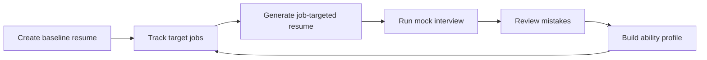
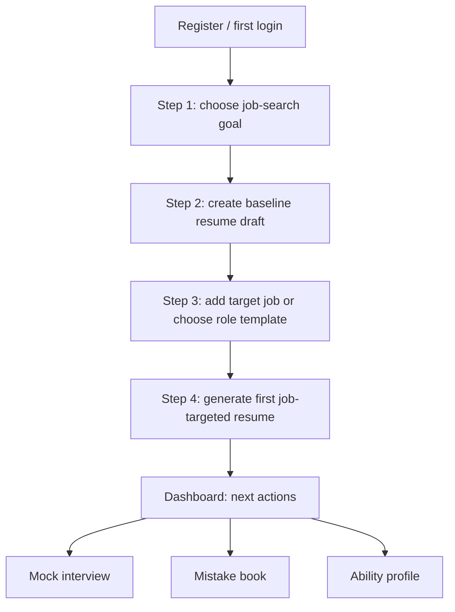

# InterCraft Product Homepage and Onboarding Handoff

## Status

Accepted product direction, based on the Qingfeng demo-account walkthrough and user interview on 2026-07-10.

## Audience

Primary audience: general job seekers across campus hiring, experienced hiring, career switching, and different industries.

The first version should not be positioned as a niche AI-engineer tool. Qingfeng's AI application engineer data is a real demonstration dataset, but the product story should stay broad: InterCraft is an AI job-search workspace that helps candidates turn a baseline resume and target jobs into tailored resumes, interview practice, mistake review, and an ability profile.

## Product Decision

Logged-out `/` should become a public product homepage focused on product demonstration and conversion.

The homepage should not be a generic brand landing page. Its job is to prove, quickly and visually, that InterCraft is a real closed-loop job-search workspace:

Current activation success point:

> A new user generates their first job-targeted resume with matching analysis, gap analysis, and optimization suggestions.

Registration, profile completion, and interview completion are important supporting events, but they are not the primary activation point for this stage.

## Homepage Strategy

### Positioning

InterCraft should be remembered as a job-search workflow product, not as a loose collection of AI resume and interview tools.

Recommended positioning frame:

- Product category: AI job-search workspace.
- Core promise: turn a baseline resume and target job into a tailored resume, interview practice loop, and reusable ability profile.
- Proof mode: real product screenshots from an anonymized sample candidate, not abstract feature claims.

### CTA Hierarchy

Primary CTA:

- Free start / sign up.

Secondary CTA:

- View sample workspace.

The secondary CTA should open a read-only sample workspace backed by the Qingfeng demo data, anonymized as "sample candidate data". It should reduce skepticism before registration, while keeping registration as the main conversion action.

### Recommended Information Architecture

1. First viewport: product name, concise value proposition, primary CTA, secondary sample-workspace CTA, and a strong product screenshot signal.
2. Closed-loop demo: show the workflow from baseline resume to target job, derived resume, mock interview, mistake review, and ability profile.
3. Capability sections: explain each product capability through real UI evidence and concrete user outcomes.
4. Trust and proof: use anonymized demo data counts, screenshots, and "what the user gets after using it" rather than vague AI claims.
5. Repeated conversion: place registration CTA after the closed-loop proof and near the end of the page.

### Messaging Guardrails

Do not overpromise capabilities that do not exist yet:

- Do not use "upload PDF and instantly optimize" as the main aha moment until PDF resume parsing can generate a reliable baseline resume.
- Do not imply automatic job application, guaranteed interview pass, or guaranteed offer.
- Do not frame the product as only for AI engineers, even though the current sample account is AI-engineer flavored.

Recommended emphasis:

- "Start from your job goal."
- "Build one baseline resume, then tailor for each role."
- "Practice interviews against the job context."
- "Turn repeated interview gaps into a visible ability profile."

## Read-Only Sample Workspace

Purpose: let undecided visitors see a real InterCraft workspace before creating an account.

Recommended behavior:

- Use Qingfeng's current demo data as the first internal sample.
- Public-facing label should be "sample candidate" or "demo candidate", not the account email.
- All write actions should be disabled or redirected to registration.
- Show a subtle sample-data marker so users do not mistake it for their own workspace.
- Use the same routes and components where possible, but with a read-only permission layer.

Longer-term recommendation:

- Add more sample candidates for non-technical audiences: campus student, operations role, product manager, finance/accounting, sales, and career switcher. This prevents the homepage from feeling too engineering-specific.

## Onboarding Strategy

Onboarding should be semi-strong: skippable, but persistent until the user reaches activation.

It should not force a long resume form before the user understands the product's value. It should guide the user toward the activation event: the first job-targeted resume.

### Flow

### Step 1: Job-Search Goal

Collect only lightweight fields:

- Job-search stage: campus hiring, experienced hiring, internship, career switch, exploratory.
- Target role or direction.
- Optional target city, industry, or company type.

Product reason: InterCraft needs to know what the user is trying to win before asking for resume details.

### Step 2: Baseline Resume Draft

Goal: create an editable baseline resume draft, not a perfect final resume.

Recommended entry modes before PDF parsing exists:

- Paste existing resume text or experience notes.
- Fill structured sections progressively.
- Start from a blank template.

Product reason: a baseline resume becomes the user's first reusable asset. It unlocks job targeting, derived resumes, and interview context.

### Step 3: Target Job or Role Template

Offer two paths:

- User has a specific JD: paste JD or create a target job.
- User has no JD yet: choose a role template, such as product manager, Java backend, data analyst, operations, finance, campus management trainee, or AI application engineer.

Product reason: strong job-specific value should be available without blocking early-stage users who do not have a JD yet.

### Step 4: First Job-Targeted Resume

Generate:

- A first job-targeted resume draft.
- Matching analysis.
- Gap analysis.
- Optimization suggestions.

This is the current aha moment.

After this, guide the user into mock interview, mistake review, and ability profile as second-layer retention loops.

## Dashboard After Onboarding

After activation, dashboard should show:

- The generated targeted resume and its target job or role template.
- Next recommended action: run a mock interview for this target.
- Visible progress toward a stronger job-search asset base.
- Empty or weak areas that can be improved, such as missing projects, missing metrics, or interview gaps.

For users who skip onboarding, dashboard should keep a lightweight progress module:

- Choose target.
- Create baseline resume.
- Add job/JD or template.
- Generate first targeted resume.

## Metrics

### Homepage Metrics

- Visitor to registration conversion.
- Secondary demo-workspace click rate.
- Demo-workspace to registration conversion.
- Scroll depth through the closed-loop demo section.

### Onboarding Metrics

- Registered user to job-search goal completion.
- Goal completion to baseline resume draft creation.
- Baseline resume draft to job/JD/template creation.
- Job/JD/template to first job-targeted resume generation.
- Time to first job-targeted resume.

### Activation Metric

Primary activation:

- First job-targeted resume generated.

Secondary activation:

- Mock interview started for the target job.
- Interview report generated.
- Mistake book contains reviewed items.
- Ability profile has non-empty dimensions.

## Screenshot Evidence

Screenshot folder:

- `docs/evidence/qingfeng-demo-account/`

Recommended homepage usage:

| Screenshot | Use |
|---|---|
| `01-dashboard.jpg` | First viewport product proof or sample workspace preview. |
| `02-resume-center.jpg` | Baseline and derived resume asset center. |
| `03-root-resume-editor.jpg` | Baseline resume creation/editing capability. |
| `04-derived-resume-bytedance.jpg` | Job-targeted resume and derivation proof. |
| `05-jobs-tracker.jpg` | Target job tracking proof. |
| `06-full-interview-report.jpg` | Mock interview report proof. |
| `07-quick-drill-report.jpg` | Quick drill proof after mistake accumulation. |
| `08-error-book.jpg` | Mistake book proof. |
| `09-ability-profile.jpg` | Ability profile proof. |
| `11-interview-history-clean.jpg` | Clean interview history for sample-workspace flow. |

Settings screenshot `10-settings.jpg` is useful for internal verification, but it is not recommended for homepage marketing.

## Implementation Backlog

### P0

- Turn logged-out `/` into public homepage.
- Add primary registration CTA and secondary read-only sample workspace CTA.
- Add anonymized Qingfeng screenshot-backed product demonstration.
- Add onboarding flow with four steps: goal, baseline resume draft, target job/template, first job-targeted resume.
- Keep onboarding skippable and restorable from dashboard.
- Add basic analytics events for homepage CTA, sample workspace, onboarding steps, and activation.

### P1

- Add role templates for users without a JD.
- Add more sample candidates across industries and seniority levels.
- Add read-only permission layer for demo workspace routes.
- Add conversion-focused experiment slots for copy and CTA variants.

### P2

- Implement PDF resume import and parsing into a baseline resume.
- After PDF parsing is reliable, consider changing the homepage aha moment to "import resume and get role-specific optimization".

## Open Questions For UIUX And Engineering

- Should the sample workspace live at a dedicated route such as `/demo`, or should it be a mode layered over existing app routes?
- How much of the app shell should be visible in demo mode before registration?
- Should onboarding be a full-screen flow, a dashboard checklist, or a hybrid?
- What role-template taxonomy is broad enough for campus and experienced candidates without becoming hard to maintain?
- Which screenshots should be converted into video/GIF-style walkthroughs after the first UI pass?
- What privacy copy is needed when public pages use anonymized sample data?

## Non-Goals

- This handoff does not define final visual style, brand system, layout, or motion design.
- This handoff does not implement PDF parsing.
- This handoff does not promise auto-application, guaranteed interview success, or offer prediction.
- This handoff does not require homepage content to stay AI-engineer specific.
