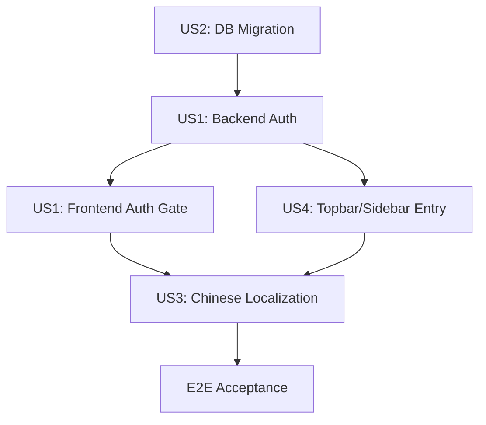

# Implementation Plan: 管理后台角色简化与汉化 (REQ-051)

**Branch**: `051-admin-role-simplify-cn` | **Date**: 2026-07-07 | **Spec**: [spec.md](./spec.md)

**Input**: Feature specification from `specs/051-admin-role-simplify-cn/spec.md`

**Supersession note**: REQ-051 supersedes the RBAC portion of REQ-044 (`specs/044-admin-console-redesign`). REQ-044's workspace definitions, endpoint contracts, and component architecture remain the implementation baseline; only the role-permission model is replaced.

## Summary

将当前管理后台的 6 角色 (pm/operations/maintainer/reviewer/owner/admin) 细粒度 capability 矩阵简化为一维 `is_admin` boolean 检查。同时将管理后台全面汉化，为主应用 Topbar 和 Sidebar 添加管理后台入口。

核心变更分为 4 个 US：
- **US1**: 后端 role→ capability 矩阵删除，所有 admin console 端点仅检查 `is_admin`
- **US2**: DB 迁移（新增 `is_admin` 列 + 存量数据调整）+ 注册流程修正确保新用户 `subscription=free / is_admin=false`
- **US3**: 管理后台 8 个工作区导航标签 + 约 336 处 UI 文字汉化（硬编码，无 i18n 框架）
- **US4**: Topbar 盾牌入口按钮 + Topbar 用户下拉菜单 + Sidebar 导航链接

## Technical Context

**Language/Version**: Backend: Python 3.11, FastAPI, SQLAlchemy 2.0, Alembic. Frontend: TypeScript 5.6, React 18, Vite 5, TanStack Query, Zustand.

**Primary Dependencies**: alembic migrations, FastAPI `Depends` auth, Zustand `useAuthStore`, React Router v6.

**Storage**: `users` 表新增 `is_admin` boolean 列（默认 `false`）。`subscription` CHECK constraint `IN ('free','pro','enterprise')` 已存在无需修改。`role` 列保持不变（留给未来产品内角色使用）。

**Testing**: Backend pytest for auth db migration + admin endpoint auth gate changes. Frontend Vitest for Topbar/Sidebar entry visibility + AdminShell simplification. Playwright E2E for admin access flow — 19 pass / 15 skip 基线（SC-008 要求回归通过率不降低）。

**Target Platform**: 已验证的 web 应用（同一域名），管理后台与主应用共享 token storage。

**Constraints**:
- 不引入 i18n 框架 — 中文文本直接硬编码
- `users.role` 列保持不变（留给未来产品内角色）
- 管理后台工作区定义和端点契约保持 REQ-044 不变
- 当前仅 `demo@intercraft.io` 需要 admin 权限，无自助 UI

**Scale/Scope**:
- 1 个 Alembic migration
- ~76 处 `require_capability()` 调用改为 `require_admin()`
- ~336 处 UI 中文文本替换
- 2 个前端导航组件修改（Topbar + Sidebar）
- 2 个前端组件删除（RoleBadgeDropdown + resolveRole/roleToWorkspaces）

## Constitution Check

*GATE: Must pass before Phase 0 research. Re-check after Phase 1 design.*

| Principle | Gate Result | Plan Response |
|---|---|---|
| I. Library-First | PASS | `require_admin()` 作为新增的单一 FastAPI dependency factory，封装在 `admin_console/auth.py` 内，call-site 仅需替换 import。 |
| II. CLI Interface | PASS | Migration 通过 alembic CLI 执行；admin 授予通过 SQL 直接操作。 |
| III. Test-First | PASS | 每个 US 开始前先写失败的 pytest/Vitest/Playwright 测试，再实施变更。 |
| IV. Integration & Synchronization Testing | PASS | E2E 覆盖 admin 入口可见性、非 admin 重定向、管理后台汉化验证。 |
| V. Observability | PASS | 403 错误日志保留现有结构，仅 capability name → `admin_required` 调整。 |

## Project Structure

### Documentation (this feature)

```text
specs/051-admin-role-simplify-cn/
|-- spec.md
|-- plan.md
|-- tasks.md
```

### Source Code (affected files)

```text
# Backend — 数据模型 + 迁移
backend/app/modules/auth/models.py          # User 模型 + is_admin 列
backend/app/modules/auth/schemas.py         # PublicUser + is_admin 字段
backend/app/modules/auth/service.py         # 注册流程 (is_admin default)
backend/app/modules/auth/repository.py      # (不变 — 仅引用)
backend/migrations/versions/0032_051_is_admin.py  # NEW: alembic migration

# Backend — admin console auth 重构
backend/app/modules/admin_console/auth.py   # 核心: _ROLE_GRANTS → require_admin()
backend/app/modules/admin_console/__init__.py  # 导出 require_admin
backend/app/main.py                         # 删除 lifespan 中的 grant_role()

# Backend — 16 个 admin console API 文件 (replace require_capability → require_admin)
backend/app/modules/admin_console/api.py
backend/app/modules/admin_console/ai_operations/api.py
backend/app/modules/admin_console/ai_operations/__init__.py
backend/app/modules/admin_console/decision_signals/api.py
backend/app/modules/admin_console/decision_signals/__init__.py
backend/app/modules/admin_console/product_analytics/api.py
backend/app/modules/admin_console/product_analytics/__init__.py
backend/app/modules/admin_console/incidents/api.py
backend/app/modules/admin_console/governance/api.py
backend/app/modules/admin_console/governance/repository.py
backend/app/modules/admin_console/governance/schemas.py
backend/app/modules/admin_console/governance/service.py
backend/app/modules/admin_console/review_snapshots/api.py
backend/app/modules/admin_console/review_snapshots/__init__.py
backend/app/modules/admin_console/saved_views/api.py
backend/app/modules/admin_console/saved_views/__init__.py
backend/app/modules/admin_console/saved_views/schemas.py
backend/app/modules/admin_console/saved_views/service.py

# Frontend — 类型 + store
src/api/types.ts                            # PublicUser + is_admin
src/types/admin-console.ts                  # 删除 ConsoleRole, 保留 WorkspaceId
src/stores/useAuthStore.ts                  # (不变 — user 对象从 API 获取)

# Frontend — admin console 入口简化
src/admin/routes.tsx                        # AdminAuthGuard 改 isAdmin 检查
src/admin/components/AdminShell.tsx         # 删除 resolveRole/roleToWorkspaces/RoleBadgeDropdown
src/admin/components/RoleBadgeDropdown.tsx  # 删除

# Frontend — 管理后台入口
src/components/layout/Topbar.tsx            # admin 入口按钮 + 用户下拉菜单项
src/components/layout/Sidebar.tsx           # admin 导航链接

# Frontend — 管理后台汉化
src/admin/components/AdminShell.tsx         # NAV_ITEMS 标签汉化
src/admin/pages/CommandCenter.tsx           # ~40 处
src/admin/pages/ProductAnalytics.tsx        # ~40 处
src/admin/pages/AIOperations.tsx            # ~40 处
src/admin/pages/IncidentsBadcases.tsx       # ~40 处
src/admin/pages/LogsAndTraces.tsx           # ~60 处
src/admin/pages/UsersAccounts.tsx           # ~30 处
src/admin/pages/Reports.tsx                 # ~30 处
src/admin/pages/Governance.tsx              # ~50 处

# E2E tests
tests/e2e/044-admin-helpers.ts              # loginAsDemo 适配 is_admin
tests/e2e/051-admin-role-simplify.spec.ts   # NEW: admin access + i18n E2E
```

## Phase 0: Research

### 0.1 Current architecture

**后端 auth 链路**:
1. `main.py` lifespan 调用 `grant_role(demo_uuid, "admin")` 将 demo 用户注入进程内存 `_user_roles` dict
2. 每个 admin console endpoint 通过 `Depends(require_capability(CAP_TOKEN))` 检查
3. `require_capability()` → `get_caller_user_id_dep()` → `user_has_capability(user_id, capability)` → 查 `_user_roles` → 查 `_ROLE_GRANTS`
4. 16 个文件中约 76 处 `require_capability()` / `ensure_capabilities()` 调用

**前端 auth 链路**:
1. `AdminAuthGuard` 检查 `hasTokens()` 和 `useAuthStore.status`
2. `AdminShell.resolveRole()` 按 4 层 fallback: localStorage → demo email hardcode → authStore.user.role → 'unknown'
3. `roleToWorkspaces()` 按 ConsoleRole 返回可见 workspace 列表
4. `useAuthStore.user` 类型为 `PublicUser`，当前不含 `is_admin` 字段

### 0.2 Key decisions

| Decision | Rationale |
|---|---|
| `require_admin()` 替换所有 `require_capability(X)` | 最简单的权限模型：admin 可见全部 8 个 workspace |
| 保留 `require_admin()` 为 dependency factory | 未来如需恢复细粒度权限，API surface 不变 |
| `is_admin` 作为 boolean 而非 role 枚举值 | 与 `subscription` (付费层级) 正交，语义清晰 |
| 汉化硬编码，不引入 i18n | 产品仅面向中文用户，降低复杂度 |
| demo@intercraft.io 的 `is_admin=true` 由 migration 设置 | 原子操作，与 schema change 在同一事务 |

### 0.3 External dependencies

- 无外部依赖变更
- `users` 表 `subscription` CHECK constraint 已支持 `'free'/'pro'/'enterprise'` — 无需修改

## Phase 1: Design

### 1.1 Data model

```sql
-- Migration 0032: Add is_admin to users
ALTER TABLE users ADD COLUMN is_admin BOOLEAN NOT NULL DEFAULT FALSE;

-- Data migration (same transaction):
UPDATE users SET subscription = 'pro';
UPDATE users SET is_admin = TRUE WHERE email = 'demo@intercraft.io';
```

### 1.2 Backend auth redesign

**Before** (6-role capability matrix):
```python
_ROLE_GRANTS: dict[str, frozenset[str]] = { ... }
require_capability(capability) -> FastAPI dependency
user_has_capability(user_id, capability) -> bool
ensure_capabilities(user_id, capabilities) -> None
```

**After** (single is_admin check):
```python
async def require_admin(
    user_id: Annotated[UUID, Depends(get_caller_user_id_dep())],
    db: Annotated[AsyncSession, Depends(db_session_dep)],
) -> bool:
    """Dependency: raises 403 if caller is not admin."""
    from sqlalchemy import select
    result = await db.execute(
        select(User.is_admin).where(User.id == user_id, User.deleted_at.is_(None))
    )
    is_admin = result.scalar()
    if not is_admin:
        raise HTTPException(status_code=403, detail={...})
    return True
```

**删除的符号**:
- `_ROLE_GRANTS`
- `_user_roles`, `_default_role`, `_lock`
- `grant_role()`, `revoke_role()`, `reset_for_tests()`, `set_default_role()`
- `user_has_capability()`, `user_capabilities()`, `require_capability()`, `ensure_capabilities()`
- 所有 capability 常量 (`REPLAY_TRIGGER`, `TASK_TAG`, `COMMAND_CENTER_VIEW`, ...)

**保留的符号**:
- `get_caller_user_id_dep()` — 仍用于 `require_admin()`
- `_missing_capability_exception()` — 改编为 `_forbidden_admin_exception()`

**Call-site 变更模式**:
```python
# Before
_cap: Annotated[bool, Depends(require_capability(AI_OPERATIONS_VIEW))],

# After
_admin: Annotated[bool, Depends(require_admin)],
```

### 1.3 PublicUser schema extension

**Backend** (`auth/schemas.py`):
```python
class PublicUser(BaseModel):
    # ... existing fields ...
    is_admin: bool = False
```

**Frontend** (`api/types.ts`):
```typescript
export interface PublicUser {
    // ... existing fields ...
    is_admin: boolean
}
```

### 1.4 Registration flow

**Backend** (`auth/service.py` register method):
- `User()` 构造时无需显式传 `is_admin` — 数据库默认 `FALSE` 生效
- 注意：`create_user()` 当前不接受 `is_admin` kwarg，但 SQLAlchemy default 已生效 — 无需修改 repository

### 1.5 Frontend admin gate

**AdminAuthGuard** (`src/admin/routes.tsx`):
```typescript
function AdminAuthGuard({ children }: { children: JSX.Element }) {
    useCurrentUser()
    const user = useAuthStore((s) => s.user)
    const status = useAuthStore((s) => s.status)
    const location = useLocation()

    if (!hasTokens()) { /* redirect to login */ }
    if (status === 'unknown') { /* loading */ }

    // NEW: admin-only gate
    if (!user?.is_admin) {
        return <Navigate to="/dashboard" replace />
    }

    return children
}
```

**AdminShell** (`src/admin/components/AdminShell.tsx`):
- 删除 `resolveRole()` 函数（4 层 fallback）
- 删除 `roleToWorkspaces()` 函数（switch-case 多路分支）
- 删除 `RoleBadgeDropdown` 组件导入
- `visibleWorkspaces` 固定为全部 8 个（当 `isAdmin=true` 时）
- NAV_ITEMS 标签全部替换为中文

### 1.6 Topbar admin entry

**Topbar** (`src/components/layout/Topbar.tsx`):
- 在 HelpCircle 按钮旁添加盾牌图标按钮（仅 `isAdmin` 可见）
- 用户下拉菜单中添加「管理后台」菜单项（admin 可点击 / 非 admin 置灰）

**Sidebar** (`src/components/layout/Sidebar.tsx`):
- `secondaryNav` 中添加「管理后台」链接（仅 `isAdmin` 可见）

### 1.7 Chinese localization

所有管理后台页面中的用户可见文字替换为中文：

| English | 中文 |
|---|---|
| Command Center | 指挥中心 |
| Product Analytics | 产品分析 |
| AI Operations | AI 运营 |
| Incidents & Badcases | 事件与差例 |
| Logs & Traces | 日志与链路 |
| Users & Accounts | 用户与账户 |
| Reports | 报告中心 |
| Governance | 治理与审计 |

其他 UI 文字匹配规则：
- 按钮/标签/表头/卡片标题 → 中文
- 枚举值 (`success/failed`) → 保留英文
- 数据 ID/trace ID 等技术标识 → 保留英文
- 列标题和筛选器标签 → 中文

### 1.8 Cleanup checklist

**main.py lifespan**:
```python
# DELETE these lines:
from uuid import UUID
from app.modules.admin_console.auth import grant_role
grant_role(UUID("019ebc56-fb4f-7978-bf91-29abc5c13d93"), "admin")
```

**RoleBadgeDropdown.tsx**: 整个文件删除

**admin-console.ts types**: 删除 `ConsoleRole` + `SharedWithRole` + 相关注释

### 1.9 E2E test adaptation

`tests/e2e/044-admin-helpers.ts` 的 `loginAsDemo()`:
- 删除 `role` 参数
- 删除 localStorage `auth-user` role 注入
- admin 入口可见性由后端 `is_admin` 字段驱动（真实 API 返回）

新增 `tests/e2e/051-admin-role-simplify.spec.ts`:
- admin 可见 Topbar 盾牌按钮
- admin 可见 Sidebar 管理后台链接
- admin 可进入全部 8 个 workspace
- 非 admin 访问 `/admin-console` 被重定向
- 管理后台导航标签为中文
- Topbar 用户菜单包含管理后台项

## Risk Register

| Risk | Probability | Impact | Mitigation |
|---|---|---|---|
| `require_capability` import 遗漏导致 import error | Medium | Low | 全局 grep + pytest 全量运行 |
| Migration 失败（表锁定 / 约束冲突） | Low | High | 幂等迁移，事务包裹 |
| 前端 PublicUser 类型不同步导致 TS error | Low | Medium | typecheck 验证 |
| E2E 测试中 localStorage role 注入失效 | Medium | Medium | 更新 `044-admin-helpers.ts`，依赖真实 API |
| 汉化遗漏（某些标签仍为英文） | Medium | Low | 目视审查 + 截图对比 |
| 非 admin 用户仍可访问管理后台（缓存状态） | Low | High | AdminAuthGuard 实时检查 `is_admin` |

## Dependencies



- US2 (migration) 是所有后端变更的前置条件
- US1 的后端 auth 变更是前端 gate + 入口的前置条件
- US3 和 US4 可以并行开发
- E2E 在所有 US 完成后执行验收
